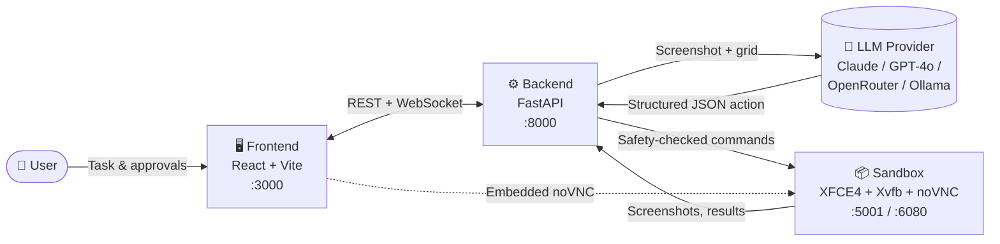
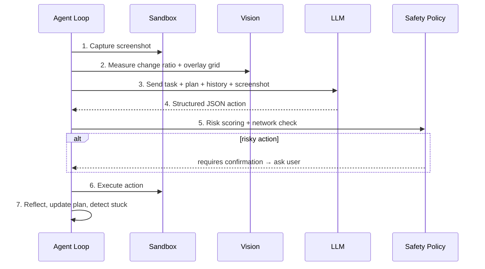

<div align="center">

# 🤖 Open Cowork — Linux Cowork Agent

**A secure, self-hosted AI desktop agent that sees, thinks and acts on a real isolated Linux desktop.**

Give it a task in plain language — it plans, looks at the screen, moves the mouse, types, browses the web, runs commands and corrects itself, all inside a sandboxed virtual desktop you can watch live in your browser.

[](https://fastapi.tiangolo.com/)
[](https://react.dev/)
[](https://www.typescriptlang.org/)
[](https://docs.docker.com/compose/)
[](https://www.python.org/)
[](https://github.com/meinzeug/open-cowork/releases)

</div>

---

## 📖 Table of Contents

- [What is Open Cowork?](#-what-is-open-cowork)
- [Key Features](#-key-features)
- [Architecture](#️-architecture)
- [Quick Start](#-quick-start)
- [Configuration](#️-configuration)
- [How the Agent Works](#-how-the-agent-works)
- [Agent Capabilities](#-agent-capabilities-action-toolbox)
- [Safety & Security](#️-safety--security)
- [LLM Providers](#-llm-providers)
- [API Reference](#-api-reference)
- [Project Structure](#-project-structure)
- [Roadmap](#️-roadmap)
- [Contributing](#-contributing)

---

## 🧠 What is Open Cowork?

Open Cowork is a fully self-hosted alternative to cloud "computer use" agents. It runs a complete **virtual Linux desktop inside Docker**, hands a screenshot of that desktop to a vision-capable LLM, and lets the model drive the machine step by step — clicking, typing, browsing and scripting — while a **safety engine** vets every single action before it executes.

You stay in control: watch the agent live via the embedded noVNC stream, approve risky actions, and hit the **E-Stop** at any moment.

> ⚠️ The agent only ever touches its isolated sandbox container. It cannot reach your host files or host network unless you explicitly wire that up.

---

## 🚀 Key Features

| | Feature | Description |
|---|---|---|
| 🖥️ | **Isolated Linux Desktop** | Lightweight XFCE4 desktop running on Xvfb inside Docker — a real GUI the agent operates. |
| 📺 | **Live noVNC Stream** | Watch the agent work in real time through a polished web dashboard. |
| 👁️ | **Advanced Screen Perception** | Coordinate-grid overlay for pixel-accurate clicks + automatic screen-change detection to verify whether each action actually had an effect. |
| 🧭 | **Autonomous Planning** | The agent breaks tasks into a tracked plan (`update_plan`), keeps persistent notes as memory, reflects after every step and detects when it's stuck. |
| 🔌 | **Modular LLM Providers** | Anthropic Claude (native computer use), OpenAI GPT-4o, OpenRouter, local Ollama vision models, and a key-free **MockProvider** for testing. |
| 🛡️ | **Robust Safety Engine** | Per-action risk scoring (`low`/`medium`/`high`), interactive confirmation gateway, and configurable risk policies. |
| 🌐 | **Network Access Policy** | Allowlist/blocklist control over outbound domains to prevent data exfiltration via `curl`, `wget`, browsers and more. |
| 🧰 | **Native Desktop Bridge** | Structured window management, active-window detection, installed-app discovery, URL launch, clipboard access and zoom-region inspection. |
| 🛑 | **E-Stop (Not-Aus)** | Instantly pause or hard-stop the agent loop from the UI. |

---

## 🏗️ Architecture

Open Cowork runs as a three-tier stack orchestrated with **Docker Compose**:



| Service | Role | Ports |
|---|---|---|
| **`sandbox`** | Isolated virtual Ubuntu desktop (Xvfb, XFCE4, VNC/noVNC) + a Python **Sandbox Agent REST API** that executes clicks, keys, shell, window management, clipboard and screenshots locally. | `5001` (API), `6080` (noVNC) |
| **`backend`** | FastAPI app: orchestrates the agent loop, manages sessions, streams WebSocket events, builds vision context, and enforces the safety + network policies. | `8000` |
| **`frontend`** | React + TypeScript (Vite) dashboard: embedded noVNC view, live action log, plan/progress panel, provider settings, network policy panel and approval dialogs. | `3000` |

---

## 💻 Quick Start

### 📋 Prerequisites

- Ubuntu/Linux host machine
- **Docker** & **Docker Compose**
- (Optional) `gh` CLI for remote sync

### ⚙️ Run the stack

```bash
# 1. Clone
git clone https://github.com/meinzeug/open-cowork.git
cd open-cowork

# 2. Configure environment
cp .env.example .env
# Edit .env and add at least one API key (e.g. ANTHROPIC_API_KEY).
# No keys? Leave them blank and use the built-in "mock" provider.

# 3. (Once) check host dependencies
./install_ubuntu.sh

# 4. Build & launch everything
./start.sh
```

Then open the dashboard at **[http://localhost:3000](http://localhost:3000)**.

> 💡 Without any API key, the default **MockProvider** lets you explore the full UI and a scripted Firefox demo workflow.

### 🐳 Docker daemon troubleshooting

If startup fails with `failed to connect to the docker API at unix:///var/run/docker.sock`, the Docker daemon isn't running or your user can't access it:

```bash
git pull
./install_ubuntu.sh
sudo systemctl enable --now docker
sudo usermod -aG docker "$USER"
newgrp docker
./start.sh
```

- If `systemctl` reports `Unit docker.service does not exist`, your host has the Docker CLI but not the Engine. Run `git pull && ./install_ubuntu.sh` — the installer repairs this via Docker CE packages or the `docker.io` fallback.
- If Docker runs but your group membership isn't active yet, `./start.sh` falls back to `sudo docker` for that run. Use `newgrp docker` (or log out/in) for passwordless access.
- On systems without `systemctl`, start Docker via your host's service manager and rerun `./start.sh`.

---

## ⚙️ Configuration

All settings are read from `.env` (see [`.env.example`](.env.example)) and [`backend/app/config.py`](backend/app/config.py).

### API keys & services

| Variable | Default | Description |
|---|---|---|
| `ANTHROPIC_API_KEY` | — | Anthropic Claude API key (native computer use). |
| `OPENAI_API_KEY` | — | OpenAI GPT-4o vision key. |
| `OPENROUTER_API_KEY` | — | OpenRouter key. |
| `OLLAMA_API_BASE` | `http://172.17.0.1:11434` | Base URL for a local Ollama server. |
| `SANDBOX_AGENT_URL` | `http://sandbox:5001` | Internal sandbox REST API URL. |

### Agent behaviour

| Variable | Default | Description |
|---|---|---|
| `DEFAULT_PROVIDER` | `mock` | Provider used for new sessions. |
| `DEFAULT_MODEL` | `mock-model` | Default model name. |
| `MAX_STEPS` | `30` | Max steps per task before auto-stop. |
| `DEFAULT_RISK_POLICY` | `confirm_high` | `auto_confirm`, `confirm_high`, or `confirm_medium_high`. |
| `NETWORK_POLICY_MODE` | `blocklist` | `blocklist` or `allowlist` for outbound access. |

### Vision / screen perception

| Variable | Default | Description |
|---|---|---|
| `VISION_GRID_OVERLAY` | `true` | Overlay a labelled coordinate grid on the screenshot sent to the LLM for pixel-accurate clicks. |
| `VISION_GRID_SPACING` | `100` | Grid spacing in screen pixels. |
| `VISION_CHANGE_DETECTION` | `true` | Measure how much the screen changed after each action. |
| `VISION_NO_EFFECT_THRESHOLD` | `0.012` | Below this change ratio, an action is treated as ineffective (feeds stuck detection). |

---

## 🔄 How the Agent Works

Each step of the agent loop ([`backend/app/agent/loop.py`](backend/app/agent/loop.py)):



The **autonomy layer** keeps a per-session plan, persistent notes, and a stuck counter. If an action is repeated or produces no visible screen change, the loop injects a strategy prompt forcing the model to change approach.

---

## 🧰 Agent Capabilities (Action Toolbox)

The LLM must return exactly one structured action per step. Available actions include:

**Mouse & keyboard:** `mouse_move`, `left_click`, `right_click`, `double_click`, `drag`, `scroll`, `type_text`, `key`

**Apps & timing:** `open_app`, `open_url`, `wait`

**Files & shell:** `read_file`, `write_file`, `list_files`, `shell_command`

**Desktop bridge:** `list_windows`, `active_window`, `focus_window`, `close_window`, `list_apps`, `clipboard_get`, `clipboard_set`

**Perception & autonomy:** `inspect_region` (zoom into a screen area), `update_plan` (manage the task plan), `finish`

---

## 🛡️ Safety & Security

Every proposed action is evaluated **before** execution by the safety engine ([`backend/app/safety/`](backend/app/safety/)):

1. **Risk scoring** — each action gets a `low` / `medium` / `high` rating.
2. **Confirmation gateway** — medium/high-risk actions (e.g. `sudo`, `rm -rf`, `dd`, `mkfs`, `chmod/chown` on system paths, credential/checkout forms) require explicit user approval, governed by `DEFAULT_RISK_POLICY`.
3. **Network access policy** — outbound requests via `curl`, `wget`, browsers, `nc`, `ssh`, `scp`, `rsync`, `ftp`, `telnet` are checked against an allowlist/blocklist to prevent data exfiltration.
4. **Strict isolation** — the container does not mount the host root and runs in a separate network bridge; the agent only sees `/workspace`.
5. **E-Stop** — pause or hard-stop the loop instantly from the dashboard.

See [`docs/safety.md`](docs/safety.md) for the full policy.

---

## 🔌 LLM Providers

Selectable per session from the dashboard ([`docs/providers.md`](docs/providers.md)):

| Provider | Models | Notes |
|---|---|---|
| **Anthropic** | Claude (computer use) | Native structured computer-use tooling. |
| **OpenAI** | `gpt-4o` | Sends screenshots as image blocks to GPT-4o Vision. |
| **OpenRouter** | `openai/gpt-4o`, other vision models | OpenAI-compatible chat completions with image blocks. |
| **Ollama** | `llama3.2-vision`, `llava` | Local, private inference on your own hardware. |
| **Mock** | `mock-model` | No API key required — scripted demo for UI/testing. |

---

## 📡 API Reference

The FastAPI backend exposes (base `http://localhost:8000`):

| Method | Endpoint | Purpose |
|---|---|---|
| `GET` | `/health` | Service health check. |
| `GET` | `/api/sessions` | List all sessions. |
| `POST` | `/api/sessions` | Create a session. |
| `GET` | `/api/sessions/{id}` | Get session state. |
| `POST` | `/api/sessions/{id}/start` | Start a task. |
| `POST` | `/api/sessions/{id}/pause` | Pause the loop. |
| `POST` | `/api/sessions/{id}/stop` | E-Stop the loop. |
| `POST` | `/api/sessions/{id}/reset` | Reset session to idle. |
| `POST` | `/api/sessions/{id}/confirm` | Approve/deny a pending risky action. |
| `GET` | `/api/sessions/{id}/screenshot` | Current desktop screenshot. |
| `WS` | `/api/sessions/{id}/events` | Real-time event/log stream. |
| `GET`/`POST` | `/api/settings` | Read/update runtime settings. |
| `GET`/`POST` | `/api/network-policy` | Read/update network policy mode. |
| `POST`/`DELETE` | `/api/network-policy/domains` | Add/remove allow/block domains. |

---

## 📁 Project Structure

```
open-cowork/
├── docker-compose.yml        # Three-service orchestration
├── start.sh / install_ubuntu.sh
├── backend/                  # FastAPI orchestrator
│   └── app/
│       ├── main.py           # REST + WebSocket API
│       ├── config.py         # Settings
│       ├── agent/            # loop.py (agent loop), vision.py (perception)
│       ├── providers/        # anthropic / openai / openrouter / ollama / mock
│       ├── safety/           # policy.py, validator.py, network.py
│       ├── sessions/         # session manager
│       └── models/           # actions & message schemas
├── frontend/                 # React + Vite + TypeScript dashboard
│   └── src/components/       # DesktopView, ActionLog, PlanPanel,
│                             # NetworkPolicyPanel, ProviderSettings, SafetyDialog
├── sandbox/                  # XFCE4 + Xvfb + noVNC + Sandbox Agent API
├── docs/                     # architecture, providers, safety, roadmap
└── workspace/                # Shared agent working directory
```

---

## 🗺️ Roadmap

Highlights (full list in [`docs/roadmap.md`](docs/roadmap.md)):

- [x] Advanced coordinate logic & zoom inspection
- [x] Screenshot history & self-reflection
- [x] WebSocket real-time logs
- [x] Native Linux desktop bridge
- [x] Autonomous planning & self-correction
- [x] Advanced screen perception (coordinate grid + change detection)
- [ ] Multi-agent collaboration & long-horizon memory

---

## 🤝 Contributing

Contributions are welcome! To get started:

1. Fork the repo and create a feature branch.
2. Make your changes (backend syntax can be checked with `python3 -m py_compile`, frontend with `npm run build`).
3. Open a pull request describing your change.

Please review [`docs/architecture.md`](docs/architecture.md) and [`docs/safety.md`](docs/safety.md) before contributing changes to the agent loop or safety engine.

---

<div align="center">

**Open Cowork** — your own autonomous Linux desktop agent, fully self-hosted and under your control.

⭐ If you find this project useful, consider starring the repository!

</div>
